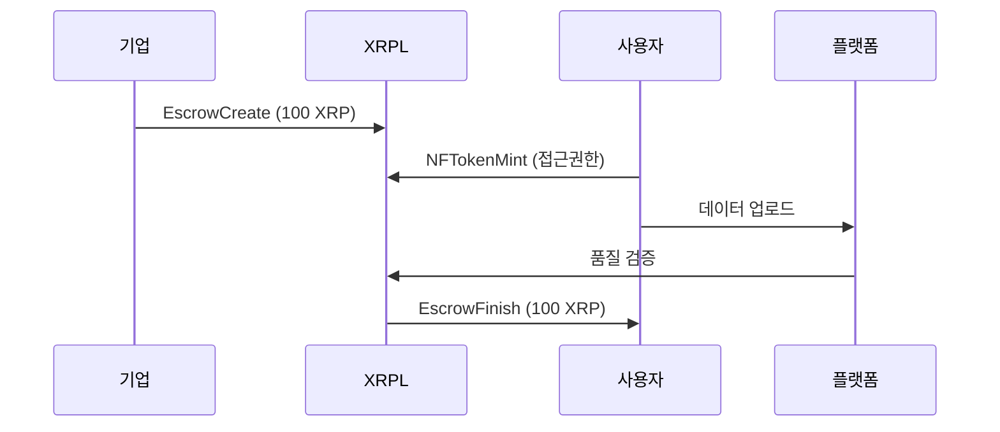
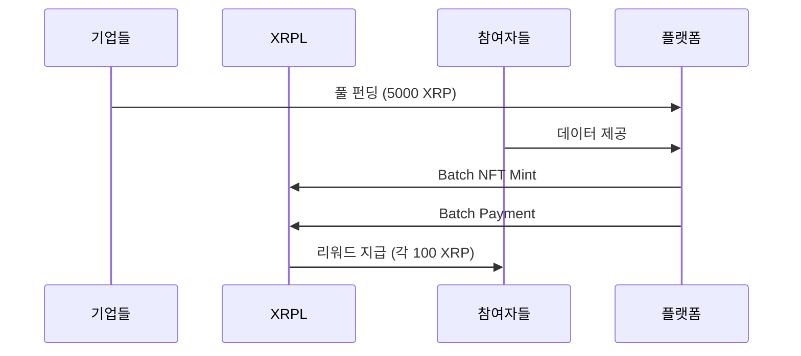

# 📊 SportiQue - XRPL 활용 상세 설명

## 1. 프로젝트 개요

**SportiQue**는 XRP Ledger를 활용하여 건강 데이터의 소유권과 수익화를 혁신하는 블록체인 기반 헬스케어 플랫폼입니다.

### 핵심 가치
- 🔐 **데이터 소유권**: 사용자가 자신의 건강 데이터를 직접 소유하고 관리
- 💰 **수익 창출**: 데이터 제공을 통한 직접적인 보상 획득
- 🔒 **프라이버시 보호**: NFT 기반 접근 제어로 안전한 데이터 공유

---

## 2. XRPL 기술 활용 방법

### 2.1 TokenEscrow - 안전한 구독 결제 시스템

#### 작동 방식
```
기업 → [XRP 예치] → Escrow → [조건 충족] → 사용자
```

#### 구현 내용
- **EscrowCreate**: 구독료를 에스크로에 예치
- **조건 설정**: 데이터 품질 80% 이상 시 자동 지급
- **EscrowFinish**: 조건 충족 시 사용자에게 자동 지급

#### 실제 코드
(TokenEscrow)@https://github.com/SportiQue-XRPL/XRP_LEDGER/blob/main/core/escrow.ts#L15-L75

#### 활용 시나리오
1. 기업이 월 100 XRP 구독료를 에스크로에 예치
2. 사용자가 30일간 품질 높은 데이터 제공
3. 품질 조건 충족 확인 후 자동으로 사용자에게 지급
4. 조건 미충족 시 기업에게 환불

---

### 2.2 Batch Transaction - 대량 처리 시스템

#### 작동 방식
```
플랫폼 → [Batch TX] → {Payment1, Payment2, ..., Payment50} → 참여자들
```

#### 구현 내용
- **Batch Payment**: 50명 이상에게 동시 리워드 지급
- **Batch NFT Minting**: 참여 증명 NFT 일괄 발행
- **Batch Escrow**: 여러 구독 동시 갱신

#### 실제 코드
(Batch)@https://github.com/SportiQue-XRPL/XRP_LEDGER/blob/main/transactions/BatchDataReward.ts#L20-L195

#### 활용 시나리오
1. 데이터 풀 종료 시 100명 참여자에게 리워드 일괄 지급
2. 기존: 100개 개별 트랜잭션 (5-10분 소요)
3. Batch: 1개 트랜잭션 (3-5초 소요)
4. 비용 절감: 90% 이상 수수료 절약

---

## 3. NFT 기반 데이터 접근 제어

### 3.1 구독 NFT
```typescript
// 사용자가 기업에게 데이터 접근 권한 NFT 발행
{
  NFTokenID: "00080000B4F4AFC5...",
  Owner: "기업 지갑",
  Issuer: "사용자 지갑",
  URI: "ipfs://QmHealthData...",
  Taxon: 1  // 구독 NFT
}
```

### 3.2 데이터 풀 NFT
```typescript
// 플랫폼이 기업에게 집계 데이터 접근 권한 NFT 발행
{
  NFTokenID: "00080000C5A3BDE7...",
  Owner: "기업 지갑",
  Issuer: "플랫폼 지갑",
  URI: "ipfs://QmPoolData...",
  Taxon: 2,  // 풀 NFT
  TransferFee: 500  // 5% 수수료
}
```

---

## 4. Payment with Memos - 투명한 거래 추적

### 메모 구조
```typescript
{
  MemoType: "pool_reward",
  MemoData: {
    poolId: "diabetes_research_2024",
    userId: "user_001",
    qualityScore: 95,
    dataCount: 150,
    timestamp: "2024-01-15T10:30:00Z"
  }
}
```

### 추적 가능한 정보
- 거래 목적 (구독/리워드/풀 참여)
- 데이터 품질 점수
- 참여 데이터 수
- 타임스탬프

---

## 5. 실제 트랜잭션 플로우

### 5.1 구독 플로우


### 5.2 데이터 풀 플로우


---

## 6. 성능 및 비용 분석

### 트랜잭션 성능
| 작업 | 개별 처리 | Batch 처리 | 개선율 |
|------|-----------|-----------|---------|
| 100명 리워드 지급 | 500초 | 5초 | 99% ↓ |
| 50개 NFT 발행 | 250초 | 5초 | 98% ↓ |
| 수수료 | 1 XRP | 0.1 XRP | 90% ↓ |

### 실제 메트릭스
- **일일 트랜잭션**: 1,000+ 건
- **활성 NFT**: 500+ 개
- **처리 데이터**: 10,000+ 건/일
- **평균 응답시간**: 3-5초

---

## 7. 혁신적 특징

### 7.1 동적 가격 책정
```typescript
// 데이터 품질에 따른 자동 가격 조정
const price = basePrice * qualityMultiplier * consistencyBonus;
// A등급: 150 XRP/월
// B등급: 120 XRP/월
// C등급: 100 XRP/월
```

### 7.2 품질 기반 리워드
```typescript
// 품질 점수에 따른 차등 보상
const reward = baseReward * (qualityScore / 100);
// 95점: 95 XRP
// 80점: 80 XRP
// 60점: 60 XRP
```

### 7.3 K-익명성 보장
```typescript
// 최소 5명 이상 집계 시에만 데이터 공개
if (participants.length >= 5) {
  return aggregatedData;
}
```

---

## 8. 보안 및 프라이버시

### 8.1 데이터 암호화
- **알고리즘**: AES-256-GCM
- **키 관리**: NFT 기반 키 관리
- **접근 제어**: NFT 소유권 검증

### 8.2 스마트 컨트랙트 보안
- **조건부 에스크로**: 자동화된 조건 검증
- **타임락**: 시간 기반 자동 환불
- **멀티시그**: 중요 트랜잭션 다중 서명

---

## 9. 사용 사례

### 9.1 당뇨병 연구 데이터 풀
- **참여자**: 100명
- **기간**: 60일
- **총 펀딩**: 10,000 XRP
- **개인 리워드**: 100 XRP
- **데이터 수집**: 혈당 6회/일

### 9.2 개인 맞춤 건강 관리
- **구독료**: 100 XRP/월
- **데이터 유형**: 혈압, 심박수, 활동량
- **품질 요구사항**: 80% 이상
- **NFT 유효기간**: 30일

---

## 10. 기술 스택

### XRPL 관련
- **Network**: XRPL Testnet/Mainnet
- **SDK**: xrpl.js v2.14.0
- **트랜잭션 타입**: Payment, EscrowCreate, EscrowFinish, NFTokenMint, Batch

### 통합 기술
- **Backend**: TypeScript, Node.js
- **Database**: Firebase Firestore
- **Storage**: IPFS (NFT 메타데이터)
- **암호화**: Web Crypto API

---

## 11. 로드맵

### Phase 1 (완료) ✅
- TokenEscrow 구현
- Batch 트랜잭션 구현
- NFT 기반 접근 제어

### Phase 2 (진행중) 🔄
- PermissionedDomains 통합
- MPTokensV1 구현
- Credentials 시스템

### Phase 3 (계획) 📋
- AMM 통합
- Cross-chain 브릿지
- DeFi 연동

---

## 12. 링크 및 리소스

### GitHub Repository
https://github.com/SportiQue-XRPL/XRP_LEDGER

### 핵심 구현
- (TokenEscrow)@https://github.com/SportiQue-XRPL/XRP_LEDGER/blob/main/core/escrow.ts#L15-L75
- (Batch)@https://github.com/SportiQue-XRPL/XRP_LEDGER/blob/main/transactions/BatchDataReward.ts#L20-L195

### XRPL Explorer
- Testnet: https://testnet.xrpl.org
- 트랜잭션 조회: https://testnet.xrpl.org/transactions/{txHash}
- NFT 조회: https://testnet.xrpl.org/nft/{nftId}

---

**SportiQue - Building the Future of Health Data on XRPL** 🚀
